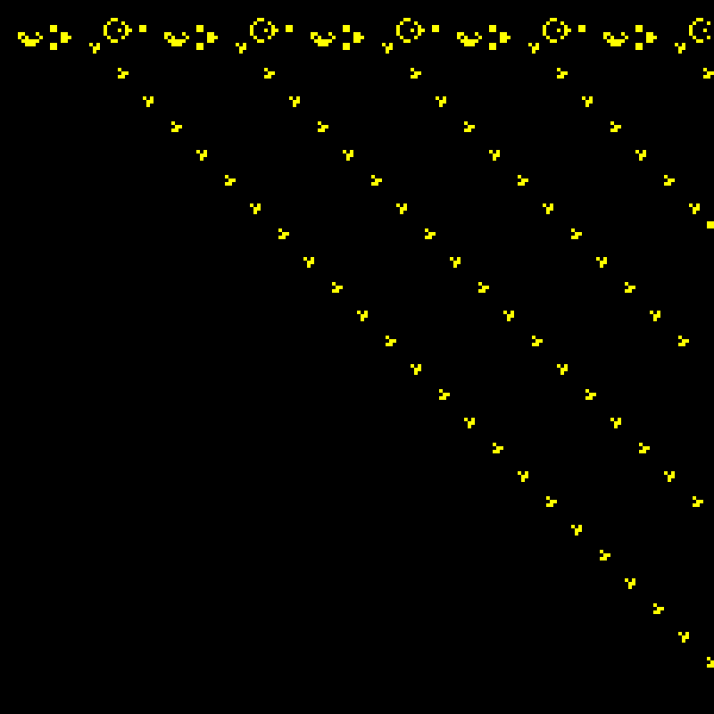

# Conway's Game of Life

<div align="center">
  
</div>

This demonstrates a parallel simulation. Many engineering and scientific computations involve computing a simple rule over
a very large space of inputs.

The demo runs a simulation of [Conway's Game of Life](https://en.wikipedia.org/wiki/Conway%27s_Game_of_Life), a popular cellular automata. Every frame represents a new
step of the simulation. Each pixel or cell in the grid lives(is yellow) or dies(is black) according
to its 8 neighboring cells.

To provide an interesting visual, we initialize the grid with a pattern called "Gosper's Glider Gun".
This is a pattern that emits a "[glider](https://en.wikipedia.org/wiki/Glider_(Conway%27s_Game_of_Life))", or a little ship that decends down and to the left.

A single Glider gun doesn't take very much space, so we repeat this pattern horizontally.

## Example Output
On a dev laptop, with an 8th gen intel core i7 but no dedicated gpu:

```
$ ./life_cpu
Last frame time: 0.149863 sec (6.672766 fps)
Last frame time: 0.209113 sec (4.782110 fps)
Last frame time: 0.267670 sec (3.735948 fps)
Last frame time: 0.335950 sec (2.976632 fps)
Last frame time: 0.381501 sec (2.621226 fps)
Last frame time: 0.413070 sec (2.420898 fps)
Last frame time: 0.389354 sec (2.568360 fps)
Last frame time: 0.421950 sec (2.369949 fps)
Last frame time: 0.410780 sec (2.434392 fps)
```

```
$ ./life_cu
Last frame time: 0.000191 sec (5228.512207 fps) (209140496.000000 cells/sec)
Last frame time: 0.000254 sec (3929.643555 fps) (157185744.000000 cells/sec)
Last frame time: 0.000192 sec (5204.240723 fps) (208169616.000000 cells/sec)
(~1000x speedup)
```
