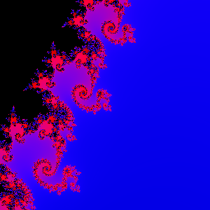

# Mandelbrot Zoomer

<div align="center">
  
</div>

This renders the Mandelbrot fractal, constantly zooming in each frame towards a point of interest. This is
a nicely parallel problem, as each pixel requires a large amount of computation but is independent from
all other pixels.

```bash
./mandelbrot_cpu
Last frame time: 0.505047 sec (1.980014 fps)
Last frame time: 0.697107 sec (1.434500 fps)
```

Gouda, opencl backend:

```bash
./mandelbrot_cu
Last frame time: 0.001075 sec (930.503479 fps)
Last frame time: 0.001217 sec (822.017578 fps)
Last frame time: 0.001222 sec (818.577087 fps)
Last frame time: 0.001298 sec (770.702820 fps)
Last frame time: 0.001398 sec (715.379761 fps)
```
